# UX Design Specification - TKD Brackets

**Author:** Asak
**Date:** 2026-01-30

---

## Executive Summary

### Project Vision

**TKD Brackets** transforms tournament bracket creation from a 2+ hour spreadsheet nightmare into a 5-minute, stress-free experience. It's a **vertical SaaS** that takes the generic bracket tool market (BracketHQ, Challonge) and deeply specializes for Taekwondo, embedding domain knowledge that generic tools cannot replicate.

**Core Value Proposition:**
> The "Aha! Moment" is when a tournament organizer creates their first complete bracket (8+ participants) in under 5 minutes — with proper TKD-specific seeding, dojang separation, and professional PDF output — all with zero manual configuration.

**Platform:** Flutter Web, Desktop-only (landscape browser optimization)
**Technology:** Supabase (Auth, Database, Storage)

---

### Target Users

| Persona              | Role                 | Tech Level | Primary Goal                                 | Device                | UX Priority                                           |
| -------------------- | -------------------- | ---------- | -------------------------------------------- | --------------------- | ----------------------------------------------------- |
| **Master Kim**       | Tournament Organizer | Moderate   | Create brackets fast, run smooth tournaments | Desktop laptop        | Primary — all design decisions optimize for this user |
| **Mrs. Rodriguez**   | Volunteer Scorer     | Low        | Enter scores correctly without confusion     | Desktop at ring table | High — zero training requirement                      |
| **David Chen**       | Spectator (Parent)   | Moderate   | Track child's matches in real-time           | Mobile phone          | Medium — view-only, polished experience               |
| **Federation Admin** | Enterprise Customer  | High       | Multi-tournament management                  | Desktop               | Future — power user features                          |

**Key User Insights:**

- **Primary users are NOT tech-savvy** — martial arts instructors, not software people
- **Time pressure is real** — setup happens night before, adjustments at 8:45 AM tournament day
- **Volunteers need zero training** — parent helpers with 2 minutes of instruction
- **Mobile is view-only** — no editing on phones, but spectators want to follow along
- **Professional appearance matters** — PDFs represent the dojang's professionalism

---

### Key Design Challenges

#### 1. Complexity Hiding
*The system handles complex TKD rules (WT/ITF/ATA federations, weight classes, dojang separation) but users must feel it's simple.*

- Smart Division Builder must feel like "magic" — not configuration
- Federation templates eliminate decision fatigue
- Advanced options for power users, hidden by default

#### 2. Keyboard-First Scoring at Speed
*Scorers enter results quickly during live matches with minimal training.*

- No mouse hunting during fast-paced sparring
- Tab/Enter flow must be intuitive
- Undo must be instant and obvious (mistakes happen under pressure)

#### 3. Tournament Day Resilience
*The "oh no" moments (no-shows at 8:45 AM) must feel recoverable, not catastrophic.*

- Clear recovery paths for bracket modifications
- Visual confidence indicators ("this change affects 3 matches")
- No accidental destructive actions

#### 4. Desktop-First BUT Mobile-Friendly Viewing
*Primary editing is desktop-only, but spectators need a usable read-only experience.*

- Two distinct experiences rather than "responsive compromise"
- Mobile viewers shouldn't see edit controls they can't use

---

## Core User Experience

### Defining Experience

**Core User Action:**
> "Create a complete, properly-seeded TKD bracket from a roster of athletes in one click."

**The Core Loop:**
```
Import Athletes → Configure Division → Generate Bracket → Score Matches → Export Results
        ↑                                                                      ↓
        ←←←←←←←←←←←←← (Next Tournament) ←←←←←←←←←←←←←←←←←←←←←←←←←←←←←←←←←←←←←←←
```

**Critical "Must Nail" Interactions:**

| Interaction                | Why It's Critical                            | Success Metric                            |
| -------------------------- | -------------------------------------------- | ----------------------------------------- |
| **Pre-Signup Demo**        | Builds trust before commitment               | User sees working bracket without account |
| **Smart Division Builder** | TKD magic — competitors sorted automatically | Feels instant, zero manual sorting        |
| **One-Click Generation**   | The payoff moment after setup                | < 500ms (progressive render for 64+)      |
| **No-Show Recovery**       | Tournament day chaos moment                  | 30-second fix, no stress                  |
| **Score Entry**            | High-frequency action during live event      | Keyboard-only, < 5 seconds per match      |

---

### Platform Strategy

| Aspect               | Decision                       | Rationale                            |
| -------------------- | ------------------------------ | ------------------------------------ |
| **Primary View**     | Desktop landscape (1280px+)    | Tournament organizers use laptops    |
| **Input Method**     | Mouse + Keyboard               | Keyboard-first for scoring speed     |
| **Mobile Support**   | View-only experience           | Spectators track matches, no editing |
| **Offline Strategy** | Graceful degradation with sync | Full offline-first is Growth feature |
| **Browser Support**  | Chrome, Firefox, Safari, Edge  | Cover 95%+ of desktop users          |

**Flutter Web Considerations:**
- Optimize for low-end Chromebooks (common in school gyms)
- Service worker for basic caching; full PWA is Growth scope
- Progressive rendering for large brackets (64+ participants)

---

### Effortless Interactions

#### 1. Pre-Signup Demo
> "I saw it work before I even created an account"

- Sample roster with realistic TKD names (not "Player 1")
- Interactive bracket — zoom, pan, click matches
- Converts skeptics by demonstrating value first

#### 2. Athlete Import
> "Paste from spreadsheet → Athletes appear sorted"

- Auto-detect columns with fallback UI for manual mapping
- Handle Excel hidden characters gracefully
- Smart matching for belt naming variations

#### 3. Division Assignment
> "System knows TKD — no explaining needed"

- Pre-loaded WT/ITF/ATA templates
- Athletes auto-sort into correct divisions
- Edge cases highlighted with suggestions

#### 4. Bracket Generation
> "One click. Done."

- Dojang separation automatic
- Optimal bye placement
- Progressive rendering for large brackets

#### 5. Score Entry
> "Tab. Type. Enter. Done."

- Current match highlighted
- Keyboard shortcuts for power users
- Undo is always Ctrl+Z

---

### Critical Success Moments

#### Success Moment 0: Pre-Signup "Aha!"
*"I didn't even have an account yet and I already saw it work"*

- Interactive demo with sample TKD data
- User sees bracket generation magic before committing
- Trust built through demonstration, not promises

#### Success Moment 1: First Bracket Creation
*"60 seconds from signup to seeing MY bracket"*

- No upfront configuration
- Account creation after seeing value

#### Success Moment 2: Smart Division Builder Magic
*"I pasted my roster and it just sorted everyone correctly"*

- System demonstrates domain knowledge immediately
- No other tool does this — it's the moat

#### Success Moment 3: Tournament Morning Recovery
*"Three kids no-showed and I fixed all brackets in 2 minutes"*

- Calm, clear recovery flow
- User feels in control

#### Success Moment 4: Professional Output
*"Parents thought we hired a professional company"*

- PDFs look official
- Venue display mode impresses spectators

---

### Experience Principles

#### 1. Value Before Signup
> "Show, don't tell — prove we work before asking for commitment."

- Interactive demo with realistic sample data
- User experiences the "aha moment" pre-registration
- Trust through demonstration beats marketing promises

#### 2. Domain Intelligence First
> "The system knows TKD, so users don't have to explain anything."

- Use TKD terminology natively (dojang, not "team")
- Smart defaults based on federation rules
- Eliminate all "generic bracket tool" friction

#### 3. Speed Over Features
> "Fast and simple beats powerful and complex."

- Optimize for the 90% case, hide the 10%
- One click accomplishes what competitors need five
- Everything feels instant

#### 4. Keyboard-First for Power
> "Scorers never touch the mouse during live matches."

- Tab/Enter flow for all data entry
- Shortcuts for common actions
- Mouse available but never required

#### 5. Autosave Everything, Undo Anything
> "Nothing is ever lost, nothing is permanent until you say so."

- Autosave every 5 seconds
- Complete undo stack for all actions
- Graceful degradation when offline (queue + sync)
- Full offline-first is Growth feature, not MVP

---

### Design Opportunities

#### 1. "Instant Gratification" First Experience
- Pre-signup interactive demo
- Shareworthy moment before account creation

#### 2. The "Anti-Excel" Visual Language
- Everything spreadsheets do badly, we do beautifully
- Animations provide clarity (winner advancing is visual, not just data)

#### 3. Contextual Intelligence
- Smart suggestions ("7 competitors — single elimination with one bye recommended")

#### 4. Venue Display Mode as Showpiece
- Projector mode makes tournaments look professional
- Photography-worthy for social media

#### 5. Professional Output as Product
- PDFs represent the dojang's professionalism
- Print-ready without adjustments
- No watermarks on free tier

---

### UX Friction Metric

> "% of users who complete first tournament using only mouse clicks"

- If users can do everything without shortcuts, defaults are working
- Keyboard shortcuts are power-user enhancements, not requirements

---

## Desired Emotional Response

### Primary Emotional Goals

#### Master Kim (Tournament Organizer)

| Emotional State | Why It Matters                            | Trigger Moment                           |
| --------------- | ----------------------------------------- | ---------------------------------------- |
| **Relief**      | He's currently stressed about tournaments | When brackets generate in seconds        |
| **Confidence**  | He needs to run a professional event      | When PDFs look polished                  |
| **Control**     | Chaos is his enemy                        | When no-show recovery is easy            |
| **Pride**       | He represents his dojang                  | When parents compliment the organization |

#### Mrs. Rodriguez (Volunteer Scorer)

| Emotional State    | Why It Matters                | Trigger Moment                |
| ------------------ | ----------------------------- | ----------------------------- |
| **Competence**     | She's afraid of messing up    | When score entry "just works" |
| **Calm**           | She didn't sign up for stress | When undo fixes any mistake   |
| **Accomplishment** | She's helping her community   | When she finishes all matches |

#### David Chen (Spectator Parent)

| Emotional State | Why It Matters                                 | Trigger Moment                           |
| --------------- | ---------------------------------------------- | ---------------------------------------- |
| **Connection**  | He wants to share in his daughter's experience | When he can follow along on his phone    |
| **Pride**       | This is about his kid                          | When he screenshots to share with family |
| **Trust**       | He trusted the dojang with his child           | When everything looks professional       |

---

### Emotional Journey Mapping

#### Master Kim's Emotional Journey

```
DISCOVERY → SKEPTICISM → CURIOSITY → "WAIT, REALLY?" → RELIEF → CONFIDENCE → ADVOCACY
     |            |           |             |            |           |            |
  "Another    "This will   "Let me      "THAT'S     "I just    "I've got   "You need
   tool?"     be like      try the       IT?!"       got 2      this."      to try
              the rest"     demo"                   hours                    this."
                                                    back"
```

**Key Transitions:**
1. **Skepticism → Curiosity**: Pre-signup demo shows it works
2. **Curiosity → Delight**: Smart Division Builder sorts roster magically
3. **Delight → Relief**: What took 2 hours now takes 5 minutes
4. **Relief → Confidence**: Professional output makes him look good
5. **Confidence → Pride**: Parents compliment the organization

#### Mrs. Rodriguez's Emotional Journey

```
ANXIETY → REASSURANCE → COMPETENCE → FLOW → ACCOMPLISHMENT
    |           |            |          |           |
 "What if    "Oh, it's    "I can     "Next...   "I did
 I mess      just typing   do this"   next..."    it!"
  up?"       numbers"
```

---

### Micro-Emotions

#### Emotions We WANT

| Micro-Emotion             | Where It Appears                                         | Design Lever            |
| ------------------------- | -------------------------------------------------------- | ----------------------- |
| **Instant Gratification** | Bracket generates in <500ms                              | Speed + animation       |
| **Smart Recognition**     | "Athletes from Kim's TKD separated automatically"        | Confirmation messages   |
| **Gentle Guidance**       | "7 competitors. Recommended: Single elimination + 1 bye" | Contextual suggestions  |
| **Forgiveness**           | "No problem, I can undo that"                            | Ctrl+Z always works     |
| **Momentum**              | Score entry → next match auto-highlights                 | Progressive advancement |
| **Polished Pride**        | PDF looks like official tournament material              | Output quality          |

#### Emotions We MUST AVOID

| Micro-Emotion     | Where It Could Appear              | Prevention Strategy                  |
| ----------------- | ---------------------------------- | ------------------------------------ |
| **Confusion**     | Too many options on first use      | Progressive disclosure               |
| **Anxiety**       | "Did that save?"                   | Visible autosave indicator           |
| **Embarrassment** | Mistake in front of parents        | Easy, obvious undo                   |
| **Overwhelm**     | 12 divisions, 6 rings, 50 athletes | Focus mode, one at a time            |
| **Distrust**      | "Will this actually work?"         | Pre-signup demo proves it            |
| **Regret**        | "I broke something"                | Confirmation for destructive actions |

---

### Design Implications

#### Emotion → Design Connection

| Desired Emotion | UX Design Approach                                                   |
| --------------- | -------------------------------------------------------------------- |
| **Relief**      | Progress indicators, completion celebrations, "you're done" states   |
| **Confidence**  | Professional visual design, polished output, clear status indicators |
| **Control**     | Easy undo, confirmation before destructive actions, visible state    |
| **Competence**  | Simple interfaces, obvious next steps, error prevention              |
| **Delight**     | Subtle animations, satisfying micro-interactions, unexpected polish  |
| **Trust**       | Consistent behavior, visible saves, reliable performance             |

#### Moments of Delight

| Moment                    | Delight Opportunity                                      |
| ------------------------- | -------------------------------------------------------- |
| **Bracket Generation**    | Smooth animation as matches "fall into place"            |
| **Score Submission**      | Winner "advances" with satisfying visual movement        |
| **PDF Export**            | Preview with implicit "This looks professional!" quality |
| **Tournament Completion** | Celebration moment — "🏆 Tournament Complete!"            |
| **Return Visit**          | "Welcome back! Your last tournament: 32 matches scored"  |

---

### Emotional Design Principles

#### 1. Relief Over Delight
> "First, remove stress. Then add polish."

Our users aren't looking for entertainment — they're escaping spreadsheet hell. Relief is the primary emotion; delight is a bonus.

#### 2. Confidence Through Visibility
> "Show them it's working, even when they're not looking."

- Autosave indicators ("Saved just now")
- Progress states ("3 of 6 divisions complete")
- Confirmation messages ("Athletes sorted into 4 divisions")

#### 3. Forgiveness by Default
> "Every mistake has a one-click fix."

- Undo is always available
- Destructive actions require confirmation
- Nothing is permanent until exported/shared

#### 4. Professional Pride
> "Make them look good to their community."

- Output quality reflects on the dojang
- Every parent-facing element is polished
- Venue display mode is a showpiece

#### 5. Calm Over Excitement
> "Tournament day is already stressful. We are the calm."

- No flashing alerts or urgent UI
- Muted, professional color palette
- Clear, predictable interactions

---

## UX Pattern Analysis & Inspiration

### Inspiring Products Analysis

#### Notion — Complexity Hiding Master
*Relevant for: Smart Division Builder, progressive disclosure*

| What They Do Well                                    | Application to TKD Brackets                            |
| ---------------------------------------------------- | ------------------------------------------------------ |
| Simple first view, power features revealed gradually | Division Builder shows simple, expands for power users |
| Templates that feel like "magic"                     | WT/ITF/ATA templates populate with one click           |
| Keyboard-first power users                           | Scoring workflows                                      |
| Database views that don't feel like databases        | Roster management                                      |

**Key Pattern:** *"Progressive disclosure through familiar metaphors"*

#### Linear — Speed & Polish for Professional Tools
*Relevant for: Fast operations, keyboard shortcuts, professional feel*

| What They Do Well                   | Application to TKD Brackets     |
| ----------------------------------- | ------------------------------- |
| Everything feels instant (<100ms)   | Bracket generation, score entry |
| Keyboard shortcuts for power users  | Scoring mode                    |
| Minimal UI with maximum information | Bracket visualization           |
| Dark mode done right                | Venue display mode              |

**Key Pattern:** *"Speed as a feature, not just performance"*

#### Airtable — Data Entry Without the Spreadsheet Feel
*Relevant for: Roster import, athlete management*

| What They Do Well                     | Application to TKD Brackets |
| ------------------------------------- | --------------------------- |
| Paste data and it just works          | CSV/spreadsheet import      |
| Visual feedback on data operations    | Division sorting animation  |
| Views feel like apps, not databases   | Tournament dashboard        |
| Inline editing without mode switching | Quick athlete adjustments   |

**Key Pattern:** *"Spreadsheet power with app-like simplicity"*

#### Figma — Canvas Navigation & Collaboration
*Relevant for: Bracket visualization, zoom/pan, sharing*

| What They Do Well                    | Application to TKD Brackets |
| ------------------------------------ | --------------------------- |
| Infinite canvas with smooth zoom/pan | Large bracket navigation    |
| Shareable links with specific views  | Public bracket sharing      |
| Real-time presence indicators        | Multi-scorer awareness      |
| Export options that maintain quality | PDF/PNG export              |

**Key Pattern:** *"Canvas interface for complex information"*

#### Stripe Dashboard — Professional Output & Trust
*Relevant for: Professional appearance, reliability feel*

| What They Do Well                       | Application to TKD Brackets      |
| --------------------------------------- | -------------------------------- |
| Clean, trustworthy aesthetic            | Tournament management UI         |
| Clear status indicators                 | Bracket progress, autosave       |
| Excellent PDF invoices/exports          | Bracket PDFs                     |
| Developer-quality UX for non-developers | Non-tech users feel professional |

**Key Pattern:** *"Professional output builds trust"*

---

### Transferable UX Patterns

#### Navigation Patterns

| Pattern                  | From            | Application                                  |
| ------------------------ | --------------- | -------------------------------------------- |
| **Command Palette**      | Linear, Notion  | Quick actions: "Add athlete", "Generate PDF" |
| **Breadcrumb + Context** | Most SaaS tools | Tournament → Division → Bracket navigation   |
| **Tab-based Workspace**  | Figma, VS Code  | Multiple divisions open simultaneously       |

#### Interaction Patterns

| Pattern                   | From           | Application                            |
| ------------------------- | -------------- | -------------------------------------- |
| **Inline Editing**        | Airtable       | Click athlete to edit, no modal needed |
| **Drag-and-Drop Seeding** | Trello, Notion | Manual seed adjustments                |
| **Keyboard Score Entry**  | Spreadsheets   | Tab/Enter flow for scoring mode        |
| **Confirmation Preview**  | Stripe         | "Generate bracket" shows preview first |

#### Visual Patterns

| Pattern                        | From             | Application                               |
| ------------------------------ | ---------------- | ----------------------------------------- |
| **Card-based Layout**          | Trello, Linear   | Division cards on dashboard               |
| **Tree/Bracket Visualization** | Tournament tools | Bracket display                           |
| **Status Pills**               | Linear, GitHub   | Match status (Pending/Complete/Bye)       |
| **Progress Indicators**        | Linear           | Tournament progress (6/12 matches scored) |

#### Feedback Patterns

| Pattern                 | From                | Application                             |
| ----------------------- | ------------------- | --------------------------------------- |
| **Toast Notifications** | Most modern apps    | "Bracket generated", "Score saved"      |
| **Optimistic Updates**  | Linear              | Score appears immediately, syncs behind |
| **Undo Snackbar**       | Google              | "Score removed. Undo"                   |
| **Autosave Indicator**  | Notion, Google Docs | "Saved just now" in corner              |

---

### Anti-Patterns to Avoid

| Anti-Pattern                    | Why It's Bad                     | Seen In              | TKD Brackets Alternative              |
| ------------------------------- | -------------------------------- | -------------------- | ------------------------------------- |
| **Modal Overload**              | Interrupts flow, feels heavy     | Many tools           | Inline editing, drawer panels         |
| **Confirmation for Everything** | Slows down power users           | Enterprise tools     | Undo instead of confirm               |
| **Wizard Fatigue**              | Too many steps to start          | Complex SaaS         | Smart defaults, skip wizard           |
| **Generic Bracket Tool Feel**   | Doesn't feel TKD-specific        | BracketHQ, Challonge | TKD terminology, federation templates |
| **Mobile-Compromised Desktop**  | Responsive that's bad everywhere | Many hybrid apps     | Separate desktop/mobile experiences   |
| **Loading Spinners Everywhere** | Destroys speed perception        | Slow apps            | Skeleton states, optimistic updates   |
| **Help Required to Start**      | High barrier to entry            | Complex tools        | Interactive demo proves it works      |

---

### Design Inspiration Strategy

#### What to ADOPT (Use Directly)

| Pattern                                  | Why                           |
| ---------------------------------------- | ----------------------------- |
| **Keyboard shortcuts for power actions** | Scorers need speed            |
| **Autosave with visible indicator**      | Tournament reliability        |
| **Optimistic updates**                   | Feel instant                  |
| **Undo snackbar**                        | Forgiveness over confirmation |
| **Card-based dashboard**                 | Clear tournament organization |

#### What to ADAPT (Modify for Our Needs)

| Pattern               | Original                | Adaptation                          |
| --------------------- | ----------------------- | ----------------------------------- |
| **Command palette**   | Complex, many commands  | Simplified: 5-10 common actions     |
| **Canvas navigation** | Figma's full complexity | Just zoom/pan for brackets          |
| **Inline editing**    | Airtable's full system  | Limited to athlete details only     |
| **Dark mode**         | Full theme system       | Venue display mode only (initially) |

#### What to AVOID

| Pattern                           | Why                             |
| --------------------------------- | ------------------------------- |
| **Setup wizards**                 | Demo-first approach instead     |
| **Feature tours**                 | Contextual hints only           |
| **Account-required before value** | Pre-signup demo                 |
| **Modal confirmations**           | Undo pattern instead            |
| **Complex role management**       | Simple invite with preset roles |

---

## Design System Foundation

### Design System Choice

**Material Design 3 (Material You)** with strategic customization for TKD Brackets.

Flutter's native design language provides the fastest path to a polished, accessible application while allowing significant brand customization through Material You's dynamic color system.

---

### Rationale for Selection

| Factor                         | Why Material 3                                                   |
| ------------------------------ | ---------------------------------------------------------------- |
| **Native Flutter Integration** | Zero friction with framework; built-in widgets                   |
| **Proven Sports UX**           | Google's sports apps (Scores, Olympics) use Material effectively |
| **Accessibility Built-in**     | WCAG compliance out of the box                                   |
| **Theming Power**              | Material You color system allows significant brand customization |
| **Speed to Market**            | Use proven patterns, customize surfaces                          |
| **Professional Quality**       | Material 3 is refined; supports "serious tool" aesthetic         |

---

### Implementation Approach

#### Phase 1: Foundation (Week 1-2)
- Set up Material 3 theme with custom color palette
- Define typography scale for desktop readability
- Create component inventory (Material vs. custom)

#### Phase 2: Core Components (Week 3-4)
- Build custom bracket visualization widget
- Create score entry component with keyboard handling
- Implement card-based division layout

#### Phase 3: Polish (Week 5-6)
- Add micro-animations per inspiration analysis
- Implement dark theme for venue display
- Fine-tune spacing and density across screens

---

### Customization Strategy

#### Component Strategy

| Component Type              | Approach                            |
| --------------------------- | ----------------------------------- |
| **Buttons, Inputs, Cards**  | Material 3 with theme customization |
| **Navigation, Dialogs**     | Material 3 (well-tested patterns)   |
| **Bracket Visualization**   | Fully custom widget                 |
| **Score Entry Modal**       | Custom modal with Material inputs   |
| **Division Builder Wizard** | Custom wizard with Material steps   |
| **PDF Templates**           | Custom layout engine                |

#### Design Tokens

**Color System:**

| Token          | Purpose                    | Value                |
| -------------- | -------------------------- | -------------------- |
| **Primary**    | Main actions, branding     | Deep Navy (#1A237E)  |
| **Secondary**  | Supporting elements        | Warm Gold (#F9A825)  |
| **Surface**    | Cards, backgrounds         | Light Gray (#F5F5F5) |
| **Background** | Page canvas                | White (#FFFFFF)      |
| **Error**      | Destructive actions, DQs   | Red (#D32F2F)        |
| **Success**    | Win indicators, completion | Green (#388E3C)      |

**Typography Scale:**

| Style    | Specification        |
| -------- | -------------------- |
| Display  | Inter 32/40 Bold     |
| Headline | Inter 24/32 SemiBold |
| Title    | Inter 18/24 Medium   |
| Body     | Inter 14/20 Regular  |
| Label    | Inter 12/16 Medium   |

**Spacing Scale:**

| Token | Value |
| ----- | ----- |
| xs    | 4dp   |
| sm    | 8dp   |
| md    | 16dp  |
| lg    | 24dp  |
| xl    | 32dp  |

**Dark Mode (Venue Display):**

| Token      | Value                  |
| ---------- | ---------------------- |
| Background | Near Black (#121212)   |
| Surface    | Dark Gray (#1E1E1E)    |
| Primary    | Lighter Navy (#5C6BC0) |
| On Surface | High-contrast white    |

---

## Defining Core Experience

### The Defining Experience

> **"Paste your roster → Watch athletes magically sort into correctly seeded brackets"**

This is the **"Aha! Moment"** — the core interaction that users will describe to friends:

*"I literally just pasted my spreadsheet and it generated TKD brackets with proper dojang separation. In like 30 seconds."*

---

### User Mental Model

#### How Users Currently Solve This

| Current Approach             | Mental Model                              | Pain Point            |
| ---------------------------- | ----------------------------------------- | --------------------- |
| **Excel Spreadsheets**       | "I build it myself cell by cell"          | 2+ hours, error-prone |
| **Generic Bracket Tools**    | "I need to manually configure everything" | No TKD knowledge      |
| **Paper Brackets**           | "I draw it by hand"                       | Can't handle changes  |
| **Specialized TKD Software** | "Expensive, complex, overkill"            | Not accessible        |

#### User Expectations vs. Reality

| User Expectation                          | TKD Brackets Reality                  |
| ----------------------------------------- | ------------------------------------- |
| "I'll need to configure federation rules" | We know WT/ITF/ATA already            |
| "I'll manually assign divisions"          | Athletes auto-sort by age/weight/belt |
| "I'll have to place byes carefully"       | Optimal bye placement automatic       |
| "Same dojang might face each other early" | Dojang separation built-in            |

#### Confusion Prevention

| Confusion Point                           | Prevention Strategy                              |
| ----------------------------------------- | ------------------------------------------------ |
| "Did it correctly apply the rules?"       | Show confirmation messages for each rule applied |
| "What if it made a mistake?"              | Easy override for any automatic decision         |
| "Will this work for my federation?"       | Federation selection upfront, rules visible      |
| "Can I trust this before tournament day?" | Preview everything before generating             |

---

### Success Criteria

#### Core Experience Metrics

| Criteria           | Target                                          |
| ------------------ | ----------------------------------------------- |
| **Speed**          | Roster to brackets < 2 minutes for 64 athletes  |
| **Accuracy**       | Zero manual intervention for 90% of tournaments |
| **Visibility**     | User sees exactly what rules were applied       |
| **Confidence**     | Preview before committing                       |
| **Recoverability** | Any auto-decision can be overridden             |

#### User Success Moments

| Moment                    | Trigger                                    |
| ------------------------- | ------------------------------------------ |
| "I figured this out fast" | First bracket generated in < 60 seconds    |
| "It knows what I need"    | System suggests correct division structure |
| "This looks professional" | PDF export exceeds expectations            |
| "I handled that crisis"   | No-show recovery in < 30 seconds           |

#### Success Indicators

1. ✅ User pastes roster without reformatting
2. ✅ System correctly identifies columns (name, dojang, age, weight, belt)
3. ✅ Athletes auto-sort into correct divisions
4. ✅ Brackets generate with proper seeding
5. ✅ Dojang separation applied without prompt
6. ✅ PDF output is print-ready

---

### Novel UX Patterns

#### Pattern Strategy

| Pattern Type          | Where Applied                                     |
| --------------------- | ------------------------------------------------- |
| **Established**       | Drag-and-drop, bracket visualization, data tables |
| **Established**       | Paste to import (Airtable, Google Sheets)         |
| **Novel Combination** | Domain intelligence + one-click generation        |
| **Novel**             | TKD-specific auto-categorization                  |

#### Our Innovation

We apply **domain intelligence** to established patterns:

| Established Pattern  | Our Innovation                        |
| -------------------- | ------------------------------------- |
| Paste from clipboard | + Column auto-detection for TKD data  |
| Data categorization  | + Federation-aware weight/age classes |
| Bracket generation   | + Dojang separation algorithms        |
| PDF export           | + Tournament-official formatting      |

#### User Education Required

**Minimal** — familiar patterns throughout:
- Paste works like spreadsheets
- Preview/generate works like document tools
- Bracket editing works like drag-and-drop
- Export works like print-to-PDF

**Trust-building needed:** Users burned by generic tools may want to verify manually at first — confidence-building UI essential.

---

### Experience Mechanics

#### 1. Initiation

| Element          | Design                                  |
| ---------------- | --------------------------------------- |
| **Entry Point**  | "Create Tournament" button on dashboard |
| **First Prompt** | "Paste your roster OR upload a file"    |
| **Mental Model** | "Just like copying from Excel"          |
| **Alternative**  | Manual entry for small (< 8) rosters    |

#### 2. The Import

| Step               | System Response                                |
| ------------------ | ---------------------------------------------- |
| User pastes roster | Instant parsing with column detection          |
| Columns identified | "Found: Name, Dojang, Age, Weight, Belt"       |
| Ambiguous column   | "Is this 'Weight' or 'Division'?" (inline fix) |
| Confirmation       | "32 athletes imported from 8 dojangs"          |

#### 3. The Magic (Division Building)

| Step                          | System Response                                |
| ----------------------------- | ---------------------------------------------- |
| User clicks "Build Divisions" | Smart Division Builder activates               |
| System analyzes roster        | "Analyzing for WT rules..."                    |
| Divisions proposed            | "6 divisions identified"                       |
| Each division shows           | "Junior Boys -45kg: 8 athletes from 4 dojangs" |
| Edge cases flagged            | "1 athlete doesn't fit standard divisions"     |

#### 4. Bracket Generation

| Step                            | System Response                                  |
| ------------------------------- | ------------------------------------------------ |
| User clicks "Generate Brackets" | < 500ms generation                               |
| Animation shows                 | Brackets build visually (satisfying)             |
| Confirmation message            | "6 brackets created. Dojang separation applied." |
| Bracket view opens              | Pan/zoom interactive bracket                     |

#### 5. Feedback Throughout

| Situation | Feedback                                                                     |
| --------- | ---------------------------------------------------------------------------- |
| Success   | Toast: "8 athletes sorted into Junior Boys -45kg"                            |
| Warning   | Yellow badge: "1 bye in this bracket"                                        |
| Issue     | Inline alert: "Two athletes from same dojang may meet in Round 2 — [Adjust]" |
| Autosave  | Corner indicator: "Saved just now"                                           |

#### 6. Completion

| Element       | Design                                          |
| ------------- | ----------------------------------------------- |
| Success state | "🏆 Tournament Ready — 6 divisions, 32 athletes" |
| Next action   | "Export PDF" or "Open Scoring Mode"             |
| Return point  | Dashboard shows tournament card with status     |

---

## Visual Design Foundation

### Color System (Extended)

#### Primary Palette

| Role                | Color      | Value   | Usage                         |
| ------------------- | ---------- | ------- | ----------------------------- |
| **Primary**         | Deep Navy  | #1A237E | Main CTAs, branding, headers  |
| **Primary Light**   | Indigo     | #3949AB | Hover states, active elements |
| **Primary Dark**    | Dark Navy  | #0D1642 | Pressed states, emphasis      |
| **Secondary**       | Warm Gold  | #F9A825 | Accents, highlights, medals   |
| **Secondary Light** | Light Gold | #FFD54F | Hover accents                 |

#### Semantic Colors

| Role        | Color | Value   | Usage                            |
| ----------- | ----- | ------- | -------------------------------- |
| **Success** | Green | #388E3C | Win states, completed actions    |
| **Warning** | Amber | #F57C00 | Byes, attention needed           |
| **Error**   | Red   | #D32F2F | Errors, DQs, destructive actions |
| **Info**    | Blue  | #1976D2 | Information, hints               |

#### Surface Colors

| Role                | Value   | Usage                              |
| ------------------- | ------- | ---------------------------------- |
| **Background**      | #FFFFFF | Page canvas                        |
| **Surface**         | #F5F5F5 | Cards, panels                      |
| **Surface Variant** | #EEEEEE | Alternating rows, subtle divisions |
| **Border**          | #E0E0E0 | Card borders, dividers             |
| **Border Strong**   | #BDBDBD | Emphasized dividers                |

#### Text Colors

| Role                        | Value   | Contrast | Usage                    |
| --------------------------- | ------- | -------- | ------------------------ |
| **On Background**           | #212121 | 16.1:1   | Primary text             |
| **On Background Secondary** | #666666 | 7.5:1    | Secondary text           |
| **On Background Disabled**  | #9E9E9E | 3.5:1    | Disabled text            |
| **On Primary**              | #FFFFFF | 12.4:1   | Text on navy backgrounds |
| **On Secondary**            | #212121 | 9.8:1    | Text on gold backgrounds |

#### Dark Mode (Venue Display)

| Role                     | Value   | Usage                  |
| ------------------------ | ------- | ---------------------- |
| **Background**           | #121212 | Dark canvas            |
| **Surface**              | #1E1E1E | Elevated surfaces      |
| **Surface Variant**      | #2D2D2D | Cards, panels          |
| **Primary**              | #7986CB | Adjusted navy for dark |
| **On Surface**           | #FFFFFF | Primary text           |
| **On Surface Secondary** | #B3B3B3 | Secondary text         |

---

### Typography System

#### Font Selection

| Type          | Font           | Rationale                                       |
| ------------- | -------------- | ----------------------------------------------- |
| **Primary**   | Inter          | Modern, highly legible, excellent for UI. Free. |
| **Monospace** | JetBrains Mono | Scores, bracket seeds (tabular figures)         |
| **Fallback**  | System UI      | Graceful degradation                            |

#### Type Scale

| Style              | Size/Height | Weight         | Usage                      |
| ------------------ | ----------- | -------------- | -------------------------- |
| **Display Large**  | 32/40       | Bold (700)     | Tournament name, hero text |
| **Display Medium** | 28/36       | Bold (700)     | Page titles                |
| **Headline**       | 24/32       | SemiBold (600) | Section headers            |
| **Title Large**    | 20/28       | SemiBold (600) | Card titles                |
| **Title Medium**   | 18/24       | Medium (500)   | Subheadings                |
| **Body Large**     | 16/24       | Regular (400)  | Primary content            |
| **Body Medium**    | 14/20       | Regular (400)  | Standard text              |
| **Body Small**     | 12/16       | Regular (400)  | Captions, metadata         |
| **Label Large**    | 14/20       | Medium (500)   | Buttons, labels            |
| **Label Medium**   | 12/16       | Medium (500)   | Chips, tags                |
| **Label Small**    | 11/16       | Medium (500)   | Overlines                  |

#### Typography Guidelines

| Principle           | Guideline                                               |
| ------------------- | ------------------------------------------------------- |
| **Readability**     | Minimum 14px for body text (scorer station readability) |
| **Hierarchy**       | Maximum 3 levels visible at once                        |
| **Contrast**        | All text meets WCAG AA (4.5:1 minimum)                  |
| **Line Length**     | 60-80 characters for comfortable reading                |
| **Tabular Figures** | Use for scores, counts, seeds (alignment)               |

---

### Spacing & Layout Foundation

#### Spacing Scale

| Token   | Value | Usage                      |
| ------- | ----- | -------------------------- |
| **XXS** | 2px   | Icon internal padding      |
| **XS**  | 4px   | Tight element spacing      |
| **SM**  | 8px   | Related element groups     |
| **MD**  | 16px  | Standard component padding |
| **LG**  | 24px  | Section separation         |
| **XL**  | 32px  | Major section gaps         |
| **XXL** | 48px  | Page-level spacing         |

#### Layout Grid

| Breakpoint                  | Columns | Gutter | Margin |
| --------------------------- | ------- | ------ | ------ |
| **Desktop (1280px+)**       | 12      | 24px   | 32px   |
| **Large Desktop (1440px+)** | 12      | 32px   | 48px   |
| **Mobile (View-only)**      | 4       | 16px   | 16px   |

#### Layout Principles

| Principle                | Application                                     |
| ------------------------ | ----------------------------------------------- |
| **Density: Comfortable** | Not cramped — volunteers need clickable targets |
| **Minimum Touch Target** | 44x44px for all interactive elements            |
| **Card-Based Layout**    | Information grouped in clear, scannable cards   |
| **Consistent Alignment** | Left-aligned text, center-aligned numerics      |
| **White Space**          | Generous padding to reduce overwhelm            |

#### Component Spacing

| Element        | Internal Padding | External Margin     |
| -------------- | ---------------- | ------------------- |
| **Button**     | 12px 24px        | 8px between buttons |
| **Card**       | 16px             | 16px between cards  |
| **Modal**      | 24px             | N/A                 |
| **Form Field** | 8px 12px         | 16px between fields |
| **List Item**  | 8px 12px         | 0 (seamless)        |

---

### Accessibility Considerations

#### Color Accessibility

| Requirement            | Implementation                                  |
| ---------------------- | ----------------------------------------------- |
| **WCAG AA (4.5:1)**    | All text passes; verified in color system       |
| **WCAG AAA (7:1)**     | Body text on backgrounds passes                 |
| **Color Independence** | Never rely on color alone (use icons, patterns) |
| **High Contrast Mode** | Support system high contrast preferences        |

#### Focus & Navigation

| Requirement             | Implementation                      |
| ----------------------- | ----------------------------------- |
| **Focus Indicators**    | 2px solid outline on focus          |
| **Tab Order**           | Logical, follows visual hierarchy   |
| **Skip Links**          | Skip to main content link           |
| **Keyboard Navigation** | All actions accessible via keyboard |

#### Screen Reader Support

| Requirement       | Implementation                       |
| ----------------- | ------------------------------------ |
| **Semantic HTML** | Proper heading hierarchy, landmarks  |
| **ARIA Labels**   | All interactive elements labeled     |
| **Live Regions**  | Score updates announced              |
| **Alt Text**      | All images have descriptive alt text |

#### Motion & Animation

| Requirement         | Implementation                         |
| ------------------- | -------------------------------------- |
| **Reduced Motion**  | Respect `prefers-reduced-motion`       |
| **Duration Limits** | Animations < 500ms                     |
| **No Flashing**     | No flashing content (seizure risk)     |
| **Purpose**         | Animations add meaning, not decoration |

---

## Design Direction Decision

### Design Directions Explored

Six distinct visual directions were explored, each applying the established visual foundation differently:

| Direction                       | Approach                             | Personality                        |
| ------------------------------- | ------------------------------------ | ---------------------------------- |
| **1. Clean Professional**       | Conservative, trustworthy, corporate | "Reliable business software"       |
| **2. Sports Energy**            | Bold, dynamic, competitive           | "ESPN meets tournament management" |
| **3. Focused Minimalist**       | Ultra-minimal, zen-like calm         | "Notion meets tournament brackets" |
| **4. Dashboard Command Center** | Information-dense, control           | "Mission control for tournaments"  |
| **5. Friendly Approachable**    | Warm, rounded, welcoming             | "Slack meets tournament brackets"  |
| **6. Hybrid Professional**      | Balanced combination                 | "Professional tool with TKD soul"  |

---

### Chosen Direction

**Direction 6: Hybrid Professional** — A balanced combination approach that adapts visual personality based on context.

#### Context-Based Design

| Context           | Visual Approach                   | Source          |
| ----------------- | --------------------------------- | --------------- |
| **Dashboard**     | Clean card grid, generous spacing | Direction 1     |
| **Bracket View**  | Bold canvas with zoom/pan         | Direction 2 + 4 |
| **Scoring Mode**  | Minimal focus UI, keyboard-first  | Direction 3     |
| **Venue Display** | Dark sports energy, high-contrast | Direction 2     |
| **Onboarding**    | Friendly tooltips, welcoming      | Direction 5     |

---

### Design Rationale

| Decision Factor          | Why Hybrid Professional                                                      |
| ------------------------ | ---------------------------------------------------------------------------- |
| **Emotional Alignment**  | "Relief Over Delight" principle — calm foundation with strategic excitement  |
| **Organizer Needs**      | Professional appearance builds Master Kim's credibility with parents         |
| **Volunteer Simplicity** | Focus mode (Direction 3 elements) reduces Mrs. Rodriguez's anxiety           |
| **Spectator Appeal**     | Venue display mode (Direction 2 elements) creates photography-worthy screens |
| **Flexibility**          | Room to evolve toward either more professional or more energetic             |

#### Key Visual Decisions

| Element           | Decision                                                         |
| ----------------- | ---------------------------------------------------------------- |
| **Cards**         | Medium rounded corners (8px), subtle elevation, clear borders    |
| **Navigation**    | Collapsible sidebar, contextual actions, breadcrumbs             |
| **Density**       | Medium — comfortable for volunteers, efficient for organizers    |
| **Color Balance** | Navy for key elements, gold for success/accent, neutral surfaces |
| **Typography**    | Clean hierarchy, tabular figures for scores                      |

---

### Implementation Approach

#### Mode-Specific Design

**Dashboard Mode:**
- Clean card grid with tournament overview
- Progress indicators for active tournaments
- Quick actions prominently displayed
- Calendar and upcoming events visible

**Setup Mode:**
- Step-by-step wizard with clear progress
- Inline validation and smart suggestions
- Preview panels for roster and divisions
- Generous spacing for form elements

**Bracket View Mode:**
- Canvas-based bracket display
- Zoom/pan controls
- Match detail popups
- Clear visual hierarchy for rounds

**Scoring Mode:**
- Minimal UI — hide everything except current match
- Large touch targets for match selection
- Keyboard input focused
- Clear visual feedback for score entry

**Venue Display Mode:**
- Dark background (#121212)
- High-contrast text and elements
- Auto-refresh for live updates
- Designed for projection (50+ foot viewing)

---

## User Journey Flows

### Critical Journeys Overview

| Journey                   | User           | Goal                   | Critical Moment               |
| ------------------------- | -------------- | ---------------------- | ----------------------------- |
| **Tournament Setup**      | Master Kim     | Create brackets fast   | Roster to brackets in < 5 min |
| **Tournament Day Crisis** | Master Kim     | Handle no-shows        | 8:45 AM crisis resolution     |
| **Scoring a Match**       | Mrs. Rodriguez | Enter scores correctly | First match entry             |
| **Spectator Tracking**    | David Chen     | Track child's matches  | Finding next match            |

---

### Journey 1: Tournament Setup

**Goal:** Create complete tournament brackets from a roster of athletes.

```mermaid
flowchart TD
    A[🏠 Dashboard] --> B[Click: Create Tournament]
    B --> C{Choose Method}
    
    C -->|New| D[Enter Tournament Details]
    C -->|Template| E[Select Previous Tournament]
    C -->|Demo| F[Try with Sample Data]
    
    D --> G[Federation Selection]
    E --> G
    F --> G
    
    G --> H[📋 Roster Import]
    H --> I{Import Method}
    
    I -->|Paste| J[Paste from Spreadsheet]
    I -->|Upload| K[Upload CSV/Excel]
    I -->|Manual| L[Enter Athletes Manually]
    
    J --> M[Column Detection]
    K --> M
    L --> N[Athletes List View]
    
    M --> |Auto-detected| N
    M --> |Needs Help| O[Column Mapping UI]
    O --> N
    
    N --> P[Review Athletes]
    
    P --> Q[🔮 Smart Division Builder]
    Q --> R[Analyzing... Rules Applied]
    R --> S[Divisions Proposed]
    
    S --> T{Review Divisions}
    T -->|Accept| U[✅ Divisions Confirmed]
    T -->|Adjust| V[Manual Division Editing]
    V --> U
    
    U --> W[🎯 Generate Brackets]
    W --> X[Bracket Generation: <500ms]
    X --> Y[Preview All Brackets]
    
    Y --> Z{Generate Outputs}
    Z -->|PDF| AA[Export Bracket PDFs]
    Z -->|Scoring| AB[Open Scoring Mode]
    Z -->|Display| AC[Open Venue Display]
    
    AA --> AE[🏆 Tournament Ready]
    AB --> AE
    AC --> AE
```



**Key Interactions:**

| Step                   | Interaction          | Feedback                                 |
| ---------------------- | -------------------- | ---------------------------------------- |
| **Roster Import**      | Paste from clipboard | "32 athletes detected from 8 dojangs"    |
| **Column Detection**   | Automatic            | "Found: Name, Dojang, Age, Weight, Belt" |
| **Division Builder**   | One-click activation | Animated sorting visualization           |
| **Bracket Generation** | One-click            | < 500ms with animation                   |

---

### Journey 2: Tournament Day Crisis

**Goal:** Handle no-shows quickly before the tournament starts.

```mermaid
flowchart TD
    A[🏆 Tournament Dashboard] --> B[Click: Division with Issue]
    B --> C[View Bracket]
    
    C --> D[See Athletes in Bracket]
    D --> E{Select No-Show Athlete}
    
    E --> F[Right-Click or Button: Mark No-Show]
    F --> G[⚠️ Confirmation Preview]
    
    G --> H[This affects N matches. Show changes?]
    H --> I[Visual: Affected matches highlighted]
    
    I --> J{Confirm?}
    J -->|Yes| K[Apply Change]
    J -->|No| L[Cancel - Return to Bracket]
    
    K --> M[Bracket Regenerates: <300ms]
    M --> N[✅ No-show applied. Bye assigned.]
    
    N --> O{More No-Shows?}
    O -->|Yes| E
    O -->|No| P[Review Updated Bracket]
    
    P --> Q{Satisfied?}
    Q -->|Yes| R[Export Updated PDFs]
    Q -->|Undo| S[Ctrl+Z: Undo Last Change]
    S --> C
    
    R --> T[🏆 Ready!]
```



**Error Recovery:**

| Error Scenario       | Recovery Path          |
| -------------------- | ---------------------- |
| Wrong athlete marked | Ctrl+Z immediate undo  |
| Need to see impact   | Preview before confirm |
| Changed mind         | Cancel at confirmation |

---

### Journey 3: Scoring a Match

**Goal:** Enter match scores correctly with minimal training.


**Keyboard Flow:**

```
[Match Displayed] → Tab → Focus athlete → Enter → Select winner → Tab → Confirm → Enter → [Next Match]
```

---

### Journey 4: Spectator Tracking

**Goal:** Find and follow a specific athlete's matches on mobile.

```mermaid
flowchart TD
    A[📱 Open Share Link] --> B[Mobile Bracket View]
    B --> C[See All Divisions]
    
    C --> D[Search: Athlete Name]
    D --> E[Athlete Found - Jump to Match]
    
    E --> F[Athlete's Bracket View]
    F --> G[Position Highlighted]
    
    G --> H[See: Next Match vs. Opponent]
    H --> I[Match Time and Ring]
    
    I --> J{Follow Live?}
    J -->|Yes| K[Enable Auto-Refresh]
    K --> L[Real-Time Updates]
    
    L --> M[Match Scored Notification]
    M --> N[Result: Won/Lost, Next Match]
    
    N --> O[Share to Family]
    O --> P[Screenshot or Share Link]
```



**Mobile Optimization:**

| Element          | Mobile Design                   |
| ---------------- | ------------------------------- |
| **Bracket View** | Horizontal scroll, pinch zoom   |
| **Search**       | Full-width, sticky header       |
| **Match Cards**  | Stacked list view               |
| **Updates**      | Push notifications (if enabled) |

---

### Journey Patterns

#### Navigation Pattern: Progressive Focus

```
Overview → Selection → Detail → Action → Confirmation → Return
```

All journeys follow this consistent pattern for predictability.

#### Feedback Pattern: Layered Confirmation

| Layer             | Example             | Timing         |
| ----------------- | ------------------- | -------------- |
| **Immediate**     | Button press visual | 0ms            |
| **Toast**         | "Score saved"       | 100ms          |
| **Visual Update** | Bracket animation   | 200-500ms      |
| **Persistent**    | Autosave indicator  | Always visible |

#### Error Pattern: Inline Recovery

| Principle   | Implementation                     |
| ----------- | ---------------------------------- |
| **Prevent** | Validation before action           |
| **Detect**  | Immediate feedback on issues       |
| **Recover** | Undo always available              |
| **Learn**   | Contextual help on repeated errors |

---

### Flow Optimization Principles

| Principle            | Application                           |
| -------------------- | ------------------------------------- |
| **Minimize Clicks**  | Every journey completes in < 5 clicks |
| **Show Progress**    | Visual indicators at every step       |
| **Clear CTAs**       | One obvious next action               |
| **Instant Feedback** | Response within 100ms                 |
| **Easy Recovery**    | Undo accessible everywhere            |
| **Contextual Help**  | Tooltips on hover, help icons         |

---

## Component Strategy

### Design System Coverage

#### Available from Material Design 3

| Category         | Components                                                                |
| ---------------- | ------------------------------------------------------------------------- |
| **Buttons**      | ElevatedButton, FilledButton, OutlinedButton, TextButton, IconButton, FAB |
| **Inputs**       | TextField, SearchBar, Checkbox, Radio, Switch, Slider                     |
| **Selection**    | DropdownMenu, MenuBar, PopupMenu, Chip, FilterChip                        |
| **Navigation**   | NavigationBar, NavigationDrawer, NavigationRail, Tabs                     |
| **Containment**  | Card, Dialog, BottomSheet, ExpansionPanel                                 |
| **Feedback**     | SnackBar, ProgressIndicator, CircularProgress, LinearProgress             |
| **Data Display** | DataTable, ListTile, Tooltip, Badge                                       |

#### Custom Components Required

| Component                  | Reason                            |
| -------------------------- | --------------------------------- |
| **Bracket Visualization**  | Domain-specific tournament tree   |
| **Score Entry Modal**      | Keyboard-first scoring interface  |
| **Smart Division Builder** | Wizard for athlete categorization |
| **Athlete Card**           | TKD-specific athlete display      |
| **Match Card**             | Match status and quick actions    |
| **Venue Display Suite**    | Projector-optimized components    |

---

### Custom Component Specifications

#### 1. Bracket Visualization Widget

**Purpose:** Display tournament bracket structure with interactive match selection.

| Aspect          | Specification                                        |
| --------------- | ---------------------------------------------------- |
| **Content**     | Rounds, matches, athletes, scores, advancement lines |
| **Layout**      | Horizontal tree structure, left-to-right progression |
| **Interaction** | Pan, zoom, click match for details                   |

**States:**

| State         | Description                            |
| ------------- | -------------------------------------- |
| Default       | Full bracket view, all matches visible |
| Focused       | Selected match highlighted             |
| Editing       | Drag-drop enabled for athlete swapping |
| Completed     | Winner path highlighted, medals marked |
| Venue Display | Dark mode, projection-optimized        |

**Variants:** Single Elimination, Double Elimination, Round Robin, Compact (PDF)

**Accessibility:** Keyboard navigation, screen reader announcements, focus indicators

---

#### 2. Score Entry Modal

**Purpose:** Quick, keyboard-friendly score input for matches.

| Aspect          | Specification                                |
| --------------- | -------------------------------------------- |
| **Content**     | Two athletes, score inputs, winner selection |
| **Layout**      | Modal on desktop, full-screen on mobile      |
| **Interaction** | Keyboard-first, Tab navigation               |

**Keyboard Shortcuts:**

| Key        | Action                |
| ---------- | --------------------- |
| `1` or `←` | Select first athlete  |
| `2` or `→` | Select second athlete |
| `Tab`      | Move between fields   |
| `Enter`    | Confirm/Submit        |
| `Esc`      | Cancel/Close          |
| `Ctrl+Z`   | Undo last action      |

**Accessibility:** ARIA live regions, focus trap, screen reader announcements

---

#### 3. Smart Division Builder

**Purpose:** Wizard for configuring athlete divisions with intelligent suggestions.

| Aspect          | Specification                                 |
| --------------- | --------------------------------------------- |
| **Content**     | Division configuration, athlete distribution  |
| **Layout**      | Split view: configuration left, preview right |
| **Interaction** | Progressive disclosure, smart defaults        |

**Wizard Steps:**

1. Federation Selection (WT/ITF/ATA)
2. Age Categories
3. Weight Classes
4. Review & Confirm

**Smart Features:** Auto-detection, suggestions, edge case alerts

---

#### 4. Athlete Card

**Purpose:** Display athlete information in lists and cards.

| Aspect       | Specification                               |
| ------------ | ------------------------------------------- |
| **Content**  | Name, dojang, age, weight, belt rank        |
| **Variants** | List Item, Card, Compact, Badge             |
| **States**   | Default, Selected, Disabled, Winner, Active |

---

#### 5. Match Card

**Purpose:** Display match information with quick actions.

| Aspect      | Specification                                   |
| ----------- | ----------------------------------------------- |
| **Content** | Match number, athletes, ring, time, score       |
| **Layout**  | Horizontal card with two athlete areas          |
| **States**  | Scheduled, In Progress, Completed, Bye, No Show |

---

#### 6. Venue Display Components

**Purpose:** Large-format display for tournament venue screens.

| Subcomponent        | Purpose                       |
| ------------------- | ----------------------------- |
| Active Match Banner | Current match in large format |
| Upcoming Queue      | Next 3-5 matches per ring     |
| Ring Status Grid    | Overview of all rings         |
| Recent Results      | Last completed matches        |

---

### Component Implementation Strategy

| Strategy                | Description                                   |
| ----------------------- | --------------------------------------------- |
| **Design System First** | Use Material 3 widgets as base                |
| **Token Consistency**   | All custom components use established tokens  |
| **Composition**         | Build complex from simple                     |
| **State Management**    | BLoC pattern for component state              |
| **Documentation**       | Each component documented with usage examples |

#### Component Hierarchy

```
AppShell (Scaffold + Navigation)
├── Dashboard
│   ├── TournamentCard (custom)
│   └── QuickActions (Material)
├── TournamentView
│   ├── DivisionList (custom)
│   ├── BracketVisualization (custom)
│   └── AthleteList (custom)
├── ScoringMode
│   ├── ScoreEntryModal (custom)
│   └── MatchQueue (custom)
└── VenueDisplay
    ├── ActiveMatchBanner (custom)
    └── UpcomingQueue (custom)
```

---

### Implementation Roadmap

#### Phase 1: Core Components (Week 1-2)

| Component             | Priority | Justification           |
| --------------------- | -------- | ----------------------- |
| Bracket Visualization | P0       | Core product value      |
| Score Entry Modal     | P0       | Tournament day critical |
| Match Card            | P0       | Used everywhere         |
| Athlete Card          | P1       | Used in all lists       |

#### Phase 2: Supporting Components (Week 3-4)

| Component              | Priority | Justification          |
| ---------------------- | -------- | ---------------------- |
| Smart Division Builder | P1       | Setup flow enabler     |
| Tournament Card        | P1       | Dashboard main element |
| Import Preview         | P1       | Onboarding flow        |

#### Phase 3: Enhancement Components (Week 5-6)

| Component            | Priority | Justification        |
| -------------------- | -------- | -------------------- |
| Venue Display Suite  | P2       | Professional upgrade |
| Animated Transitions | P3       | Polish               |
| Keyboard Hints       | P3       | Power user discovery |

---

## UX Consistency Patterns

### Button Hierarchy

#### Button Types & Usage

| Button Type              | Visual                  | When to Use           | Example             |
| ------------------------ | ----------------------- | --------------------- | ------------------- |
| **Primary (Filled)**     | Navy fill, white text   | Main action on screen | "Generate Brackets" |
| **Secondary (Outlined)** | Navy outline, navy text | Alternative action    | "Save Draft"        |
| **Tertiary (Text)**      | No fill, navy text      | Minor action          | "Cancel"            |
| **Destructive**          | Red fill/outline        | Dangerous action      | "Delete Tournament" |
| **Icon Only**            | Icon with tooltip       | Compact UI            | Edit, Delete icons  |

#### Button Placement Rules

| Rule                            | Application                             |
| ------------------------------- | --------------------------------------- |
| **Primary on right**            | Modal confirmations: [Cancel] [Confirm] |
| **Destructive isolated**        | Separated from other actions            |
| **One primary per context**     | Never compete for attention             |
| **Icons + labels on first use** | Learn icons, then icon-only OK          |

#### Button States

| State    | Design                         |
| -------- | ------------------------------ |
| Default  | Standard styling               |
| Hover    | Slight elevation, lighter fill |
| Pressed  | Darker fill, pressed shadow    |
| Focused  | 2px navy outline (keyboard)    |
| Disabled | 50% opacity, no interaction    |
| Loading  | Spinner replaces label         |

---

### Feedback Patterns

#### Feedback Types

| Type               | Visual              | Duration            | Use Case          |
| ------------------ | ------------------- | ------------------- | ----------------- |
| **Success Toast**  | Green with ✓ icon   | 3 seconds           | Score saved       |
| **Error Toast**    | Red with ✗ icon     | 5 seconds + dismiss | Validation failed |
| **Warning Banner** | Amber with ⚠ icon   | Persistent          | Dojang conflict   |
| **Info Toast**     | Blue with ℹ icon    | 4 seconds           | Athletes imported |
| **Progress Bar**   | Navy fill animation | Until complete      | File upload       |

#### Confirmation Patterns

| Action Severity  | Confirmation Type              |
| ---------------- | ------------------------------ |
| Non-destructive  | No confirmation needed         |
| Recoverable      | Toast with undo option         |
| Destructive      | Dialog with explicit button    |
| Very destructive | Dialog with typed confirmation |

---

### Form Patterns

#### Form Layout

| Element                | Specification                |
| ---------------------- | ---------------------------- |
| **Label Position**     | Above input (stacked)        |
| **Required Indicator** | Red asterisk (*) after label |
| **Help Text**          | Below input, gray, 12px      |
| **Error Messages**     | Below input, red, 12px       |
| **Field Spacing**      | 16px between fields          |

#### Validation States

| State    | Visual                          |
| -------- | ------------------------------- |
| Default  | Gray border                     |
| Focused  | Navy border, subtle shadow      |
| Valid    | Green check icon (optional)     |
| Error    | Red border, red error message   |
| Disabled | Gray background, no interaction |

---

### Navigation Patterns

#### Navigation Structure

```
App Shell
├── Sidebar (permanent on desktop)
│   ├── Dashboard (home)
│   ├── Tournaments (list)
│   ├── Templates (list)
│   └── Settings
└── Content Area
    ├── Breadcrumbs (context)
    ├── Page Header (title + actions)
    └── Page Content
```

#### Sidebar Behavior

| Breakpoint          | Behavior                    |
| ------------------- | --------------------------- |
| Desktop (1280px+)   | Always visible, collapsible |
| Tablet (768-1279px) | Collapsed by default        |
| Mobile              | Hidden, hamburger menu      |

#### Page Transitions

| From   | To     | Transition  |
| ------ | ------ | ----------- |
| List   | Detail | Slide right |
| Parent | Child  | Slide right |
| Modal  | Close  | Fade out    |
| Tab    | Tab    | Fade cross  |

---

### Empty & Loading States

#### Empty States

| Context           | Design                                            |
| ----------------- | ------------------------------------------------- |
| First use         | Illustration + "Create your first tournament" CTA |
| Search no results | "No athletes match" + suggestion                  |
| Empty list        | Contextual illustration + CTA                     |

#### Loading States

| Duration   | Pattern                      |
| ---------- | ---------------------------- |
| < 300ms    | No indicator (feels instant) |
| 300ms - 2s | Subtle spinner or skeleton   |
| > 2s       | Progress bar with percentage |

---

### Modal & Overlay Patterns

#### Modal Types

| Type         | Use Case                   | Close Behavior     |
| ------------ | -------------------------- | ------------------ |
| Dialog       | Confirmation, simple forms | Esc, Cancel button |
| Full-screen  | Score entry, complex forms | Close button, Esc  |
| Bottom Sheet | Mobile actions, pickers    | Swipe down         |
| Popover      | Contextual menus           | Click outside      |

#### Z-Index Hierarchy

| Layer                | Z-Index |
| -------------------- | ------- |
| Navigation (sidebar) | 100     |
| Page content         | 0       |
| Floating buttons     | 200     |
| Tooltips             | 300     |
| Modal overlay        | 400     |
| Modal content        | 500     |
| Toast notifications  | 600     |

---

### Error & Recovery Patterns

#### Error Prevention

| Strategy       | Application                        |
| -------------- | ---------------------------------- |
| Validation     | Inline, before submit              |
| Confirmation   | Preview before destructive actions |
| Smart Defaults | Pre-fill likely values             |
| Constraints    | Disable impossible actions         |

#### Error Recovery

| Error Type        | Recovery Pattern             |
| ----------------- | ---------------------------- |
| Typo              | Inline edit, re-validate     |
| Wrong selection   | Ctrl+Z undo                  |
| Wrong winner      | Edit match, recalculate      |
| Accidental delete | Toast with undo (5 seconds)  |
| System error      | Retry button + clear message |

---

### Mobile Considerations

#### Touch Targets

| Element    | Minimum Size             |
| ---------- | ------------------------ |
| Buttons    | 44x44px                  |
| List items | 48px height              |
| Icons      | 24px icon + 10px padding |

#### Mobile Adaptations

| Desktop Pattern | Mobile Adaptation       |
| --------------- | ----------------------- |
| Hover states    | Tap states              |
| Tooltips        | Long-press or help icon |
| Sidebars        | Hamburger menu          |
| Tables          | Card-based list         |
| Multi-column    | Stacked single column   |

---

## Responsive Design & Accessibility

### Platform Focus

| Platform                  | Support Level | Focus                         |
| ------------------------- | ------------- | ----------------------------- |
| **Desktop Web (1280px+)** | Primary       | Full feature set, power users |
| **Tablet (768-1279px)**   | Secondary     | Touch-optimized admin         |
| **Mobile (< 768px)**      | View-only     | Spectator access              |

### Responsive Strategy

#### Desktop Strategy (Primary)

| Aspect                  | Approach                               |
| ----------------------- | -------------------------------------- |
| **Layout**              | Full sidebar + content area            |
| **Information Density** | High — show more data                  |
| **Navigation**          | Persistent sidebar, keyboard shortcuts |
| **Interactions**        | Keyboard-first, hover states           |

#### Tablet Strategy (Secondary)

| Aspect           | Approach                        |
| ---------------- | ------------------------------- |
| **Layout**       | Collapsible sidebar             |
| **Navigation**   | Tab bar or drawer               |
| **Interactions** | Touch-optimized, larger targets |

#### Mobile Strategy (View-Only)

| Aspect       | Approach                          |
| ------------ | --------------------------------- |
| **Layout**   | Single column, bottom navigation  |
| **Purpose**  | Spectator viewing, athlete lookup |
| **Features** | Search, follow, share             |

---

### Breakpoint Strategy

| Breakpoint             | Range           | Layout                       |
| ---------------------- | --------------- | ---------------------------- |
| **Mobile (sm)**        | < 768px         | Single column, bottom nav    |
| **Tablet (md)**        | 768px - 1279px  | Collapsed sidebar            |
| **Desktop (lg)**       | 1280px - 1439px | Full sidebar, 12-column grid |
| **Large Desktop (xl)** | 1440px+         | Extended sidebar, 3-panel    |

**Design Approach:** Desktop-First (primary platform)

---

### Accessibility Strategy

#### WCAG Compliance Target

**WCAG 2.1 Level AA** — Industry standard for good accessibility.

#### Color & Contrast

| Requirement      | Specification        |
| ---------------- | -------------------- |
| Text Contrast    | 4.5:1 minimum        |
| Large Text       | 3:1 minimum (18px+)  |
| UI Components    | 3:1 against adjacent |
| Focus Indicators | Visible, 2px minimum |

#### Keyboard Navigation

| Requirement     | Implementation        |
| --------------- | --------------------- |
| All Interactive | Keyboard accessible   |
| Focus Order     | Logical tab order     |
| Skip Links      | Skip to main content  |
| Focus Trap      | Modals trap focus     |
| Visible Focus   | Clear focus indicator |

---

### Visual Feedback Strategy (No Audio)

*Decision: No audio feedback — rely on visual + screen reader announcements*

| Feedback Type            | Implementation                         |
| ------------------------ | -------------------------------------- |
| **Save Flash**           | Subtle green border pulse (150ms)      |
| **Persistent Indicator** | "Last saved: just now" in corner       |
| **Haptic Feedback**      | Brief vibration on mobile/tablet       |
| **Screen Reader**        | `aria-live="polite"` announces actions |

---

### Flutter-Specific Accessibility

| Feature                    | Implementation                        |
| -------------------------- | ------------------------------------- |
| **Semantic Bracket Nodes** | Each match as navigable semantic node |
| **Match Relationships**    | "Winner advances to..." announcements |
| **Reduced Motion**         | Respect `prefers-reduced-motion`      |
| **Text Scaling**           | Handle browser zoom 100%-200%         |
| **Large Text Toggle**      | In-app setting independent of system  |
| **High-Contrast Mode**     | Dedicated mode for bright/dim venues  |

---

### Mobile Code Optimization

| Strategy                     | Benefit                          |
| ---------------------------- | -------------------------------- |
| **Conditional Code Loading** | Exclude editing code from mobile |
| **Smaller Bundle**           | Faster load for spectators       |
| **View-Only Enforcement**    | Clean separation at build level  |

---

### Testing Strategy

#### Automated Accessibility Testing

| Tool                    | Purpose                     | Stage       |
| ----------------------- | --------------------------- | ----------- |
| **axe-core**            | WCAG compliance scanning    | CI Pipeline |
| **accessibility_tools** | Debug semantic tree overlay | Development |
| **Contrast Checker**    | Color ratio verification    | CI Pipeline |
| **Focus Tests**         | Tab order and trap testing  | CI Pipeline |

#### Manual Testing Checklist

| Test                       | Platform                   | Priority |
| -------------------------- | -------------------------- | -------- |
| VoiceOver Testing          | Safari macOS               | P0       |
| Keyboard-Only Navigation   | All browsers               | P0       |
| 200% Browser Zoom          | Chrome, Firefox            | P1       |
| Color Blindness Simulation | Chromatic Vision Simulator | P1       |

#### CI Pipeline Structure

```
Stage 1: Unit Tests (fast feedback)
    ↓
Stage 2: Integration Tests
    ↓
Stage 3: Accessibility Tests (separate stage)
    ↓
Stage 4: Build & Deploy
```

---

### Implementation Guidelines

#### Responsive Development

| Guideline        | Implementation                 |
| ---------------- | ------------------------------ |
| Relative Units   | Use rem, %, vw, vh             |
| Fluid Typography | clamp() for responsive fonts   |
| Flexible Images  | max-width: 100%                |
| CSS Grid         | Responsive layouts             |
| Mobile-First CSS | Base styles, min-width queries |

#### Accessibility Development

| Guideline         | Implementation                     |
| ----------------- | ---------------------------------- |
| Semantic HTML     | header, nav, main, article         |
| Heading Hierarchy | Single h1, logical h2-h6           |
| ARIA Roles        | role="button", role="dialog"       |
| Live Regions      | aria-live for dynamic updates      |
| Focus Management  | Focus new content, return on close |
